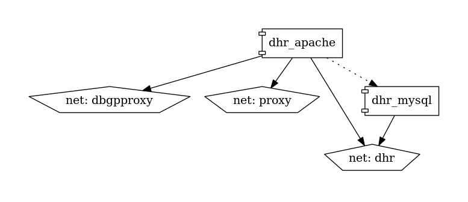

# daheardit

## Endpoints

- Page d'accueil : [daheardit.${DP_DOMAIN}](http://daheardit.${DP_DOMAIN})

## Socle technique

- [docker-compose.yml](https://github.com/constructions-incongrues/developer-portal-domain/blob/master/srv/daheardit/docker-compose.yml)
- [Dockerfile.apache](https://github.com/constructions-incongrues/net.daheardit-records.www/blob/master/service/Dockerfile.apache)

