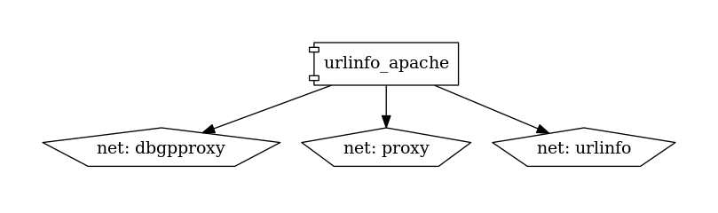

# urlinfo

## Endpoints

- Page d'accueil : [urlinfo.${DOMAIN}](http://urlinfo.${DOMAIN})

## Socle technique

- [Dockerfile.apache](https://github.com/constructions-incongrues/urlinfo/blob/master/Dockerfile.apache)
- [docker-compose.yml](docker-compose.yml)

